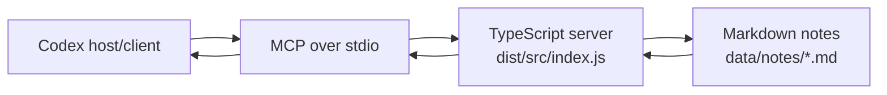

# Local Knowledge Desk MCP Demo

Local Knowledge Desk is a small TypeScript server that teaches the core ideas
behind the Model Context Protocol (MCP). It lets Codex create, list, read,
search, summarize, and delete local Markdown notes.

The MCP server and its note data are fully local. The server needs no API key,
database, hosted service, or separate account. Codex may still use its normal
authenticated model service. Notes remain ordinary files that you can inspect
with any text editor.

## MCP mental model

In this demo:

- **Codex is the MCP host/client.** It launches the configured server,
  discovers its capabilities, and decides when to use them.
- **This Node.js process is the MCP server.** It advertises capabilities and
  handles requests from Codex.
- **Tools perform actions.** For example, `create_note` writes a file and
  `search_notes` searches the local collection.
- **Resources expose context.** Each note can be discovered and read through a
  `note://<id>` URI.
- **Prompts package reusable workflow instructions.** They tell Codex how to
  combine capabilities, but prompts do not call tools themselves. Codex reads
  the prompt instructions and then makes any tool calls.



`stdio` is the transport: MCP protocol messages travel through the server
process's standard input and standard output.

## Prerequisites

- Node.js 20 or newer
- npm

Check your installation:

```powershell
node --version
npm --version
```

## Setup

From the repository root:

```powershell
npm install
npm run build
npm test
```

Run the build before opening Codex. The generated `dist/` directory is ignored
by Git, so it does not exist in a fresh checkout. Codex cannot launch
`dist/src/index.js` until `npm run build` has created it.

If `npm install` fails behind a corporate TLS proxy with
`UNABLE_TO_VERIFY_LEAF_SIGNATURE` and your Node version supports
`--use-system-ca`, tell Node to use the operating system's CA store for the
current PowerShell session, then retry:

```powershell
$env:NODE_OPTIONS='--use-system-ca'
npm install
```

Check `node --help` for `--use-system-ca`. On older Node releases, update Node
or ask your administrator for the proxy certificate and configure
`NODE_EXTRA_CA_CERTS` instead.

## Connect Codex

The project-scoped [`.codex/config.toml`](.codex/config.toml) contains:

```toml
[mcp_servers.local-knowledge-desk]
command = "node"
args = ["dist/src/index.js"]
cwd = "."
startup_timeout_sec = 10
tool_timeout_sec = 30
enabled = true
```

This tells Codex to start the compiled server with Node, communicate over
stdio, and use the repository root as the working directory.

Make sure the repository is trusted in Codex so project-scoped configuration
can load. After building, open a **new Codex session from this repository**.
Project MCP configuration is loaded when a session starts; an already-open
session may not notice a newly built server or changed configuration.

## Try the demo

Ask Codex requests such as:

1. `List the tools, resources, and prompts provided by the Local Knowledge Desk.`
2. `Create a note called mcp-basics titled MCP Basics with the body "Tools perform actions. Resources expose context. Prompts provide reusable workflow instructions."`
3. `Search my notes for resources.`
4. `List the available note resources.`
5. `Read note://mcp-basics.`
6. `Use the daily_review prompt.`
7. `Use the research_digest prompt with the topic "MCP resource design".`
8. `Delete mcp-basics, but ask me to confirm before deleting it.`

The final request matters: Codex should obtain your confirmation before
calling `delete_note` with `confirm: true`.

## Capabilities

### Tools

The server exposes exactly six tools:

| Tool | Purpose |
| --- | --- |
| `create_note` | Create a note from an ID, title, and body. Existing notes are never overwritten. |
| `list_notes` | List note IDs and titles. |
| `read_note` | Read one Markdown note by ID. |
| `search_notes` | Search titles and bodies with a case-insensitive text query. |
| `workspace_summary` | Report the number of notes and their IDs and titles. |
| `delete_note` | Delete one note only when `confirm` is explicitly `true`. |

### Resources

The resource URI template is exactly:

```text
note://{id}
```

For example, the note stored as `data/notes/mcp-basics.md` is available as
`note://mcp-basics`. Resource discovery lists existing notes, and reading a
resource returns `text/markdown`.

### Prompts

The server exposes exactly two prompts:

| Prompt | Purpose |
| --- | --- |
| `daily_review` | Instruct Codex to list and read relevant notes, identify priorities, and cite note IDs. |
| `research_digest` | Accept a required `topic`, then instruct Codex to search and read matching notes, synthesize findings, and cite note IDs. |

Again, these prompts return instructions. They do not execute
`list_notes`, `search_notes`, or `read_note` by themselves.

## Local data

Notes are UTF-8 Markdown files under:

```text
data/notes/*.md
```

Each file uses this format:

```markdown
# Note Title

Note body.
```

The filename is the note ID, such as `mcp-basics.md`. You can inspect or back
up these files with normal local tools. Runtime notes are ignored by Git by
default; change `.gitignore` deliberately if you want to version them. The
server creates `data/notes/` when needed. Set `KNOWLEDGE_DESK_NOTES_DIR` before
launching the server to use another notes directory.

## Project guide

| File | Responsibility and extension point |
| --- | --- |
| `src/note-store.ts` | Filesystem storage, Markdown parsing, ID validation, path containment, overwrite prevention, and symlink checks. Add storage operations here or replace/adapt `NoteStore` for another local backend. |
| `src/server.ts` | MCP server instructions and all `registerTool`, `registerResource`, and `registerPrompt` calls. Add or change MCP capabilities here. |
| `src/index.ts` | Process entry point. Resolves `KNOWLEDGE_DESK_NOTES_DIR`, constructs the store and server, and connects the stdio transport. Change process wiring or transport setup here. |
| `test/note-store.test.ts` | Storage behavior, validation, filesystem safety, and error cases. |
| `test/server.test.ts` | MCP discovery, tool calls, resources, prompts, and protocol-facing errors. |
| `test/entrypoint.test.ts` | End-to-end stdio startup, handshake, and capability discovery against the compiled entry point. |
| `.codex/config.toml` | Project-scoped command Codex uses to launch the compiled server. |
| `package.json` | Build, test, watch, and start commands. |

## Extend the server

### Add a tool

1. Add any required storage method in `src/note-store.ts`.
2. Register the tool with `server.registerTool(...)` in `src/server.ts`.
3. Define a Zod input schema and accurate MCP annotations.
4. Add storage tests and protocol-level tests.
5. Run `npm run build` so Codex launches the new compiled code.

### Add a resource

1. Decide on a stable URI or URI template.
2. Register it with `server.registerResource(...)` in `src/server.ts`.
3. Return the correct MIME type and avoid exposing internal filesystem paths.
4. Test resource discovery and reading.

### Add a prompt

1. Register it with `server.registerPrompt(...)` in `src/server.ts`.
2. Add a Zod argument schema when the workflow needs inputs.
3. Return clear workflow instructions that name the relevant tools.
4. Test prompt discovery, argument validation, and returned messages.

Prompts should remain instructions. Tool execution belongs to the host/client.

## Safety model

This is a local-user teaching demo, not a hardened multi-user service or a
security boundary against a hostile administrator:

- Note IDs allow only lowercase ASCII letters, digits, and internal hyphens,
  with a maximum length of 64 characters. Windows device names and path
  traversal forms are rejected.
- Resolved note paths must remain beneath the configured notes root.
- Creation uses exclusive file creation, so an existing note is not
  overwritten, including during concurrent creates.
- Deletion requires `confirm: true`, and the server instructions tell Codex to
  ask for user intent first.
- The notes root must be a real directory rather than a symbolic link. Note
  reads and deletes reject non-regular files, including symbolic links.
- Unexpected storage errors are logged to stderr while clients receive the
  sanitized message `Unexpected local storage error.` Internal paths are not
  returned through MCP.

On platforms that provide `O_NOFOLLOW`, reads use it to avoid following a
symlink at open time. Windows does not provide the same Node.js flag, so there
is a residual check/open race: a highly privileged local process that replaces
a checked file concurrently may beat the safety checks. That limitation is
acceptable for this local-user demo, but a hostile multi-user deployment needs
stronger OS-level isolation and filesystem controls.

## Troubleshooting

### Codex shows no Local Knowledge Desk tools

- Confirm `npm run build` completed successfully.
- Confirm `dist/src/index.js` exists.
- Confirm the repository is trusted so Codex may load `.codex/config.toml`.
- Start a new Codex session from the repository root so
  `.codex/config.toml` is loaded.
- Check that Node.js 20 or newer is available as `node`.

### Codex is using stale behavior

TypeScript changes do not update `dist/` automatically. Run:

```powershell
npm run build
```

Then start a new Codex session so the server process uses the rebuilt files.

### The stdio connection breaks after adding logging

Do not write ordinary logs to stdout. Stdout is reserved for MCP protocol
messages, and extra text can corrupt the connection. Send diagnostics to
stderr with `console.error(...)`.

### The server starts in the wrong directory

The default notes path is resolved from the server's working directory.
Codex uses `cwd = "."` from the repository-scoped configuration. Other hosts
should set a correct working directory, use absolute paths, or set
`KNOWLEDGE_DESK_NOTES_DIR`.

On Windows, prefer absolute paths and remember to escape backslashes inside
JSON strings, for example `D:\\Projects\\local-knowledge-desk`.

### npm reports a TLS certificate error

For `UNABLE_TO_VERIFY_LEAF_SIGNATURE` behind a managed corporate proxy, first
check whether `node --help` lists `--use-system-ca`. If it does, retry in
PowerShell with:

```powershell
$env:NODE_OPTIONS='--use-system-ca'
npm install
```

If that flag is unavailable, update Node or configure your organization's CA
certificate through `NODE_EXTRA_CA_CERTS`.

## Optional: Claude Desktop

Claude Desktop can launch the same stdio server. Build first, then add an entry
like this to the Claude Desktop MCP configuration:

```json
{
  "mcpServers": {
    "local-knowledge-desk": {
      "command": "node",
      "args": [
        "D:\\REPLACE\\WITH\\ABSOLUTE\\PATH\\local-knowledge-desk\\dist\\src\\index.js"
      ],
      "env": {
        "KNOWLEDGE_DESK_NOTES_DIR": "D:\\REPLACE\\WITH\\ABSOLUTE\\PATH\\local-knowledge-desk\\data\\notes"
      }
    }
  }
}
```

Replace both clearly marked Windows paths with absolute paths on your machine.
The `env` block is optional; omit it to use `data/notes` relative to Claude
Desktop's server working directory. Using an absolute
`KNOWLEDGE_DESK_NOTES_DIR` is less ambiguous. Restart Claude Desktop after
changing its configuration.

On macOS or Linux, use the same JSON structure with absolute POSIX paths, such
as `/Users/you/projects/local-knowledge-desk/dist/src/index.js`.

## Development commands

```powershell
npm run build       # Compile TypeScript into dist/
npm test            # Run the test suite once
npm run test:watch  # Run tests in watch mode
npm start           # Start the compiled stdio server
```

When running `npm start` directly, the process may appear idle. That is normal:
it is waiting for an MCP client to communicate over stdio.
